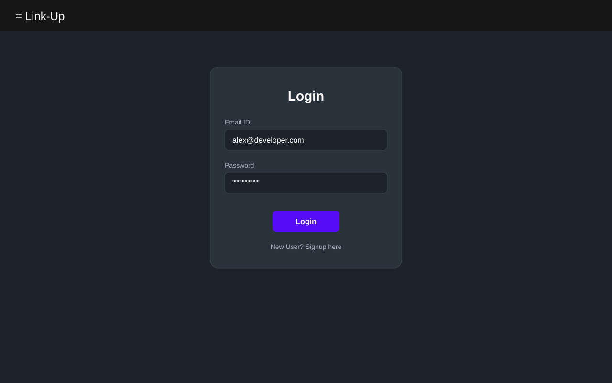
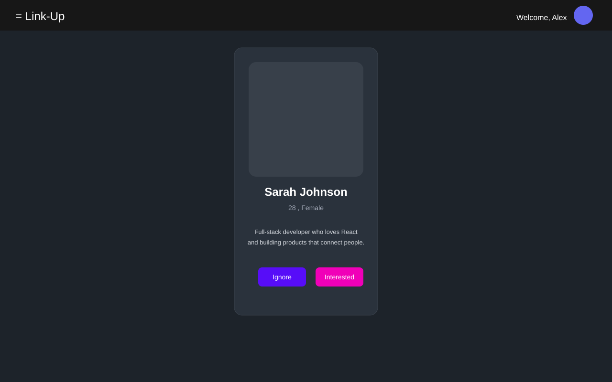
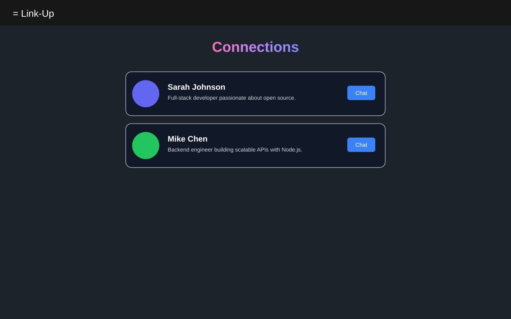
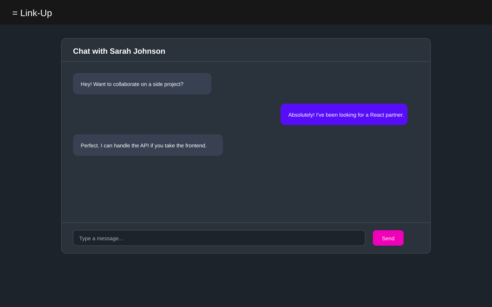

# Link-Up Web

Frontend for **Link-Up** — a developer networking app to discover people, send connection requests, accept matches, and chat in real time.

**Backend:** [link-up](https://github.com/SansarKakkar/devtinder)

## Preview

| Login | Discover Feed |
| ----- | ------------- |
|  |  |

| Connections | Real-time Chat |
| ----------- | -------------- |
|  |  |

## Features

- Sign up and login with cookie-based authentication
- Swipe-style feed to discover new profiles
- Send **Interested** or **Ignore** on user cards
- Auto-load the next feed batch without refreshing
- View and respond to incoming connection requests
- Browse accepted connections
- Real-time 1:1 chat with Socket.IO
- Edit your profile (name, age, gender, about, photo)

## Tech Stack

| Layer | Tools |
| ----- | ----- |
| UI | React 19, Vite |
| State | Redux Toolkit |
| Routing | React Router |
| HTTP | Axios |
| Real-time | Socket.IO Client |
| Styling | Tailwind CSS 4, DaisyUI |

## Project Structure

```
src/
├── App.jsx
├── components/
│   ├── Feed.jsx
│   ├── UserCard.jsx
│   ├── Login.jsx
│   ├── Profile.jsx
│   ├── Requests.jsx
│   ├── connections.jsx
│   └── chat.jsx
└── utils/
    ├── appStore.js
    ├── constants.js
    └── socket.js
```

## Getting Started

### Prerequisites

- Node.js 18+
- [link-up](https://github.com/SansarKakkar/devtinder) backend running on port **3000**

### Installation

```bash
git clone https://github.com/SansarKakkar/devtinder-web.git
cd devtinder-web
npm install
```

### Run

```bash
npm run dev
```

Open **http://localhost:5173**

### Build

```bash
npm run build
npm run preview
```

## Routes

| Path | Page |
| ---- | ---- |
| `/` | Discover feed |
| `/login` | Login / Sign up |
| `/profile` | Your profile |
| `/requests` | Incoming connection requests |
| `/connections` | Accepted connections |
| `/chat/:targetUserId` | Chat with a connection |

## How It Works

1. **Feed** — Browse profiles one at a time. Tap *Interested* or *Ignore* to move on. When a batch runs out, the next batch loads automatically.
2. **Requests** — Accept or reject incoming *Interested* requests.
3. **Connections** — Accepted matches appear on the Connections page.
4. **Chat** — Open a connection to start a real-time conversation.

## Scripts

| Command | Description |
| ------- | ----------- |
| `npm run dev` | Start Vite dev server |
| `npm run build` | Production build |
| `npm run preview` | Preview production build |
| `npm run lint` | Run ESLint |

## Author

**Sansar Kakkar**
